# Code Spec (开发规范标准库)

**一句话概括：用这套规范和 AI 对话，你来说需求，AI 来写代码，全程不扯皮，不返工。**

本项目是一个面向 AI 时代的 **高精度研发规范库**。通过 **OpenSpec** 理念，我们将模糊的业务需求转化为机器可理解、人可审计的标准化文档，从而让 AI（如 Trae, Claude, GPT）能够生成几乎零偏差的代码。

> 💡 **核心理念**：与其直接让 AI 写代码（容易"幻觉"），不如先让 AI 写"需求文档"，你确认后，再让 AI 照着文档写代码。

---

## 🎯 适用人群

| 角色 | 为什么需要它？ |
| :--- | :--- |
| **创业者/产品经理** | 不懂技术？没关系。你只需描述需求，AI 照着规范生成可运行的代码，减少沟通成本。 |
| **独立开发者** | 一个人搞定前后端。用规范锁定需求，避免自己前后逻辑不一致。 |
| **技术团队负责人** | 建立团队统一标准，让 AI 生成的代码风格一致，降低后期维护成本。 |

---

## 🏃 典型使用场景

- **快速验证想法**：凌晨 3 点有个产品想法，用 Trae 召唤 workflow-master，2 小时后拿到可运行的原型。
- **外包项目交接**：把规范文档甩给 AI，任何人接手都能生成一致风格的代码。
- **遗留系统重构**：用规范重新定义接口，AI 辅助迁移，保证新接口 100% 兼容旧逻辑。

---

## 📚 规范文档导航

| 类别 | 文档名称 | 说明 |
| :--- | :--- | :--- |
| **产品需求** | [PRD文档编写规范](./规范-PRD文档编写.md) | 定义 PRD 结构、用户故事、验收标准及 AI 生成指引。 |
| **后端开发** | [技术栈 & 系统环境](./规范-技术栈&系统环境.md) | 包含架构设计、代码规范、日志/异常/测试标准。 |
| **接口定义** | [API 接口定义规范](./规范-API接口定义.md) | 基于 OpenSpec 的 RESTful API 定义、字段表格化及交互契约。 |
| **前端开发** | [前端页面设计规范](./规范-前端页面设计.md) | Vue 3 + Element Plus 的 B 端页面布局与交互标准。 |
| **移动端** | [小程序页面设计规范](./规范-小程序页面设计.md) | 基于品牌调性的小程序视觉与组件交互规范。 |
| **运维部署** | [自动化部署流程规范](./规范-自动化部署流程.md) | 包含 CI/CD 流程、原子发布脚本及回滚机制。 |

---

## 📂 目录结构：产物去哪了？

为了让项目井然有序，AI 在执行任务时会按照以下"仓库"存放产物：

-   **`docs/1-requirements/`**：存放 **PRD 需求文档**。这是项目的灵魂，定义了"要做什么"，文件命名格式：`requirement-{RequirementID}.md`。
-   **`docs/2-design/`**：存放 **交互设计文档**。定义了"长什么样"以及按钮点下去会发生什么，文件命名格式：`design-{RequirementID}.md`。
-   **`docs/3-api/`**：存放 **API 接口契约**。这是前后端沟通的"法律文件"，锁定所有字段，文件命名格式：`api-{RequirementID}.md`。
-   **`docs/code/`**：存放 **代码变更清单**。实现阶段生成的文档，记录所有新增/修改/删除的文件，文件命名格式：`code-{RequirementID}.md`。
-   **`code/backend/`**：存放 **后端源代码**（Java/Spring Boot 等）。
-   **`code/frontend/`**：存放 **前端源代码**（Vue/React/小程序等）。
-   **`scripts/`**：存放 **自动化脚本**。包含标准化的部署工具：
    -   `deploy-backend.sh`：后端自动化部署脚本。
    -   `deploy-frontend.sh`：前端自动化部署脚本。

---

## 🤖 自动化技能链 (Trae Skills)

本项目内置了一套基于 Trae Skills 的“虚拟研发团队”，每个角色各司其职，通过分阶段交付确保最终代码的高质量：

-   **[requirement-analyst](./.trae/skills/requirement-analyst/SKILL.md)**:
    -   **职责**：听取你的想法，把它写成标准的 [PRD 需求文档](./规范-PRD文档编写.md)。
    -   **核心约束**：必须包含 Gherkin 语法的验收标准，锁定业务逻辑。
-   **[ui-ux-designer](./.trae/skills/ui-ux-designer/SKILL.md)**:
    -   **职责**：根据 PRD 生成 [Web设计](./规范-前端页面设计.md) 或 [小程序设计](./规范-小程序页面设计.md) 规格。
    -   **核心约束**：锁定布局、交互状态和数据处理规则（如金额/日期格式）。
-   **[system-architect](./.trae/skills/system-architect/SKILL.md)**:
    -   **职责**：根据设计稿锁定 [API定义](./规范-API接口定义.md) 和 [技术栈环境](./规范-技术栈&系统环境.md)。
    -   **核心约束**：通过表格锁定字段，定义业务边界和异步事件模型。
-   **[project-implementer](./.trae/skills/project-implementer/SKILL.md)**:
    -   **职责**：执行高精度代码生成。
    -   **核心约束**：严禁自行脑补字段，必须严格遵循技术规范和 API 契约。
-   **[workflow-master](./.trae/skills/workflow-master/SKILL.md)**:
    -   **职责**：作为工作流的总编排器，引导用户提出需求、校验 Requirement ID、分阶段交付产物、确保 AI 始终读取最新的"已确认"文档。
    -   **核心约束**：每个项目必须提供唯一 Requirement ID，所有产物文件必须以该 ID 作为后缀，实现阶段必须生成代码变更清单。**工作流阶段**：
      1. **Requirement ID 校验**：检查 ID 是否已存在
      2. **需求分析**：调用 `requirement-analyst` 生成 PRD
      3. **交互设计**：调用 `ui-ux-designer` 生成设计规格
      4. **系统架构**：调用 `system-architect` 生成 API 契约
      5. **工程实现**：调用 `project-implementer` 生成代码 + 代码变更清单始终读取最新的“已确认”文档。

### **工作流可视化 (Spec-Driven Workflow)**

```mermaid
%%{init: {'theme': 'default', 'themeVariables': { 'primaryColor': '#3b82f6', 'primaryTextColor': '#ffffff', 'primaryBorderColor': '#1d4ed8', 'lineColor': '#94a3b8', 'tertiaryColor': '#f8fafc', 'nodeBorder': '#cbd5e1', 'clusterBkg': '#f1f5f9', 'clusterBorder': '#e2e8f0', 'fontSize': '14px' }}}%%
graph LR
    %% 主流程节点
    Start(["🎯 开始<br/>提出原始需求<br/>+ Requirement ID"])
    End(["🚀 交付<br/>代码 + 变更清单"])
    
    Master[["🛠️ workflow-master<br/>工作流总控"]]
    
    IDCheck{"✅ Requirement ID<br/>唯一性校验"}
    
    subgraph S1 [第一阶段：需求分析]
        A1["📋 requirement-analyst"]
        B1["📄 产出 PRD 文档<br/>requirement-{ID}.md"]
        C1{"👁️ 人工审计"}
    end

    subgraph S2 [第二阶段：交互设计]
        A2["🎨 ui-ux-designer"]
        B2["🖼️ 产出设计规格<br/>design-{ID}.md"]
        C2{"👁️ 人工审计"}
    end

    subgraph S3 [第三阶段：系统架构]
        A3["🏗️ system-architect"]
        B3["🔗 产出 API 契约<br/>api-{ID}.md"]
        C3{"👁️ 人工审计"}
    end

   subgraph S4 [第四阶段：工程实现]
        A4["💻 project-implementer"]
        B4["⚙️ 生成前后端代码<br/>+ code-{ID}.md"]
    end

    %% 连接关系
    Start --> Master
    Master --> IDCheck
    
    IDCheck -- "ID 重复" --> Start
    IDCheck -- "ID 有效" --> A1
    
    A1 --> B1 --> C1
    C1 -- "✅ 通过" --> A2
    C1 -- "❌ 需修正" --> A1
    
    A2 --> B2 --> C2
    C2 -- "✅ 通过" --> A3
    C2 -- "❌ 需修正" --> A2
    
    A3 --> B3 --> C3
    C3 -- "✅ 通过" --> A4
    C3 -- "❌ 需修正" --> A3
    
    A4 --> B4 --> End

    %% 样式美化
    style Start fill:#10b981,color:#ffffff,stroke:#047857
    style End fill:#ef4444,color:#ffffff,stroke:#dc2626
    style Master fill:#6366f1,color:#ffffff,stroke:#4f46e5,stroke-width:2px
    style IDCheck fill:#f59e0b,color:#ffffff,stroke:#d97706,stroke-width:2px
    
    style A1 fill:#3b82f6,color:#ffffff
    style A2 fill:#8b5cf6,color:#ffffff
    style A3 fill:#06b6d4,color:#ffffff
    style A4 fill:#f59e0b,color:#ffffff
    
    style B1 fill:#93c5fd,stroke:#3b82f6
    style B2 fill:#c4b5fd,stroke:#8b5cf6
    style B3 fill:#67e8f9,stroke:#06b6d4
    style B4 fill:#fde68a,stroke:#f59e0b
    
    style C1 fill:#f3f4f6,stroke:#9ca3af
    style C2 fill:#f3f4f6,stroke:#9ca3af
    style C3 fill:#f3f4f6,stroke:#9ca3af

    style S1 fill:#f1f5f9,stroke:#cbd5e1
    style S2 fill:#f1f5f9,stroke:#cbd5e1
    style S3 fill:#f1f5f9,stroke:#cbd5e1
    style S4 fill:#f1f5f9,stroke:#cbd5e1
```

---

## 🛠️ 快速上手：如何一步步把想法变成代码？

你不需要记住复杂的指令，只需按照以下步骤走：

### 第一步：启动工作流并提供 Requirement ID
在 Trae 的对话框中召唤 **工作流管家**：
> “使用 `workflow-master` 启动一个新项目：[描述你的需求]，需求编码ID：`REQ-20240129-001`”

**Requirement ID 要求**：
- 格式：`REQ-{YYYYMMDD}-{序号}` 或自定义（如 `P001`, `TASK-2024012901`）
- **唯一性**：系统会自动检查 ID 是否已存在，如重复会提示你使用新 ID
- 所有产物文件都会以该 ID 作为后缀

### 第二步：审计与确认（最重要！）
AI 会分 4 阶段产出文档，每完成一步都会停下来请你确认：
-   检查 `docs/1-requirements/`：需求对吗？→ 确认后进入设计阶段
-   检查 `docs/2-design/`：布局喜欢吗？→ 确认后进入 API 阶段
-   检查 `docs/3-api/`：字段全吗？→ 确认后进入实现阶段
-   **确认方式**：直接在对话框回复"已确认，进入下一阶段"。

### 第三步：收货
当所有规格文档锁定后，AI 会：
-   自动生成 `code/` 下的前后端代码
-   生成 `docs/code/code-{RequirementID}.md` 记录代码变更清单
-   你可以运行测试，并根据 **部署前置配置** 填写相关参数后，使用 `scripts/` 中的脚本进行部署。

### 📁 产物文件命名规则

| 阶段 | 文件路径 | 命名格式 |
| :--- | :--- | :--- |
| 需求 | `docs/1-requirements/` | `requirement-{RequirementID}.md` |
| 设计 | `docs/2-design/` | `design-{RequirementID}.md` |
| API | `docs/3-api/` | `api-{RequirementID}.md` |
| 代码变更 | `docs/code/` | `code-{RequirementID}.md` |

---

## 🎯 核心理念 (OpenSpec)

> **与其直接让 AI 写代码，不如先写"需求文档"。文档就是法律，AI 只负责执行。**

本项目的所有规范均遵循 **OpenSpec** 思想：

| 原则 | 说明 |
| :--- | :--- |
| **意图锁定 (Lock Intent)** | 通过表格和 Gherkin 语法，把"我觉得"变成"必须是"。 |
| **单一事实来源 (Single Source of Truth)** | 文档就是法律。AI 生成代码时只看文档，不靠猜。 |
| **可执行性 (Executable)** | 规范不只是给人看的，更是直接喂给 AI 的高精度指令。 |

---

## 🤝 协作建议

-   **对于用户/PM**：重点关注 `docs/` 下的文档，只要文档是对的，代码就是对的。
-   **对于开发者**：如果发现 AI 生成的代码有误，优先去修改 `docs/` 下的 API 或技术规范，而不是直接改代码。修改规范后让 AI 重新生成，这才是"规范驱动"的正确姿势。

---

## ⚠️ 部署前置配置

在运行 `scripts/` 目录下的自动化部署脚本前，请确保完成以下配置：

| 配置项 | 说明 | 示例 |
| :--- | :--- | :--- |
| **服务器信息** | 目标服务器 IP、SSH 端口、用户名、密钥/密码 | IP: 192.168.1.100, User: deploy |
| **部署路径** | 应用在服务器上的存放目录 | `/var/www/app` 或 `/opt/backend` |
| **数据库连接** | JDBC URL、用户名、密码 | `jdbc:mysql://localhost:3306/db` |
| **中间件配置** | Redis、消息队列、对象存储等连接信息 | Redis: `redis://localhost:6379` |
| **环境参数** | JVM 参数、Nginx 配置、SSL 证书路径 | `-Xmx512m`, `/etc/nginx/ssl/` |
