# Code Spec (开发规范标准库)

**一句话概括：用这套规范和 AI 对话，你来说需求，AI 来写代码，全程不扯皮，不返工。**

本项目是一个面向 AI 时代的 **高精度研发规范库**。通过 **OpenSpec** 理念，我们将模糊的业务需求转化为机器可理解、人可审计的标准化文档，从而让 AI（如 Trae, Claude, GPT）能够生成几乎零偏差的代码。

> 💡 **核心理念**：与其直接让 AI 写代码（容易"幻觉"），不如先让 AI 写"需求文档"，你确认后，再让 AI 照着文档写代码。

---

## 📚 规范文档导航

| 类别 | 文档名称 | 说明 |
| :--- | :--- | :--- |
| **基础配置** | [00-全局定义](./规范-00-全局定义.md) | **核心必读**：定义项目名、包名、服务器 IP 等全局变量。 |
| **后端开发** | [01-后端开发规范](./规范-01-后端开发规范.md) | 包含架构设计、代码命名、异常、Redis、异步处理标准。 |
| **前端开发** | [02-前端开发规范](./规范-02-前端开发规范.md) | Vue 3 + Element Plus 的目录结构、组件命名与接口封装。 |
| **数据库** | [03-数据库设计规范](./规范-03-数据库设计规范.md) | 数据库命名、索引、通用字段及数据类型约束。 |
| **工程质量** | [04-测试与版本管理](./规范-04-测试与版本管理规范.md) | 单元测试标准、Mock 策略及 Git Commit 规范。 |
| **系统环境** | [05-系统环境与非功能需求](./规范-05-系统环境与非功能需求.md) | 软件版本要求、安全性、性能及 UX 兼容性标准。 |
| **产品需求** | [PRD文档编写规范](./规范-PRD文档编写.md) | 定义 PRD 结构、用户故事、验收标准及 AI 生成指引。 |
| **接口定义** | [API 接口定义规范](./规范-API接口定义.md) | 基于 OpenSpec 的 RESTful API 定义、字段表格化及交互契约。 |
| **前端页面** | [前端后台页面设计规范](./规范-前端后台页面设计.md) | B 端页面布局、颜色、字体与交互组件视觉标准。 |
| **移动端** | [小程序页面设计规范](./规范-小程序页面设计.md) | 基于品牌调性的小程序视觉与组件交互规范。 |
| **运维部署** | [自动化部署流程规范](./规范-自动化部署流程.md) | 包含 CI/CD 流程、原子发布脚本及配置驱动发布机制。 |

---

## 📂 目录结构：产物去哪了？

为了让项目井然有序，AI 在执行任务时会按照以下"仓库"存放产物：

-   **`docs/1-requirements/`**：存放 **PRD 需求文档**。这是项目的灵魂，定义了"要做什么"，文件命名格式：`requirement-{RequirementID}.md`。
-   **`docs/2-design/`**：存放 **交互设计文档**。定义了"长什么样"以及按钮点下去会发生什么，文件命名格式：`design-{RequirementID}.md`。
-   **`docs/3-api/`**：存放 **API 接口契约**。这是前后端沟通的"法律文件"，锁定所有字段，文件命名格式：`api-{RequirementID}.md`。
-   **`docs/code/`**：存放 **代码变更清单**。实现阶段生成的文档，记录所有新增/修改/删除的文件，文件命名格式：`code-{RequirementID}.md`。
-   **`code/backend/`**：存放 **后端源代码**（Java/Spring Boot 等）。
-   **`code/frontend/`**：存放 **前端源代码**（Vue/React/小程序等）。
-   **`scripts/`**：存放 **自动化脚本**。包含标准化的部署工具：
    -   `deploy-backend.sh`：后端自动化部署脚本。
    -   `deploy-frontend.sh`：前端自动化部署脚本。

---

## 🤖 自动化技能链 (Trae Skills)

本项目内置了一套基于 Trae Skills 的“虚拟研发团队”，每个角色各司其职，通过分阶段交付确保最终代码的高质量：

-   **[requirement-analyst](./.trae/skills/requirement-analyst/SKILL.md)**:
    -   **职责**：听取你的想法，把它写成标准的 [PRD 需求文档](./规范-PRD文档编写.md)。
-   **[ui-ux-designer](./.trae/skills/ui-ux-designer/SKILL.md)**:
    -   **职责**：根据 PRD 生成 [Web设计](./规范-前端后台页面设计.md) 或 [小程序设计](./规范-小程序页面设计.md) 规格。
-   **[system-architect](./.trae/skills/system-architect/SKILL.md)**:
    -   **职责**：根据设计稿锁定 [API定义](./规范-API接口定义.md) 和 [后端/数据库规范](./规范-01-后端开发规范.md)。
-   **[project-implementer](./.trae/skills/project-implementer/SKILL.md)**:
    -   **职责**：执行高精度代码生成。
-   **[workflow-master](./.trae/skills/workflow-master/SKILL.md)**:
    -   **职责**：作为工作流的总编排器，引导用户提出需求、校验 Requirement ID、分阶段交付产物、确保 AI 始终读取最新的"已确认"文档。

### **工作流可视化 (Spec-Driven Workflow)**

```mermaid
graph LR
    Start([开始<br/>需求+ID])
    End([交付<br/>代码+清单])
    Master[[工作流总控]]
    IDCheck{ID唯一性校验}
    
    subgraph S1 ["需求分析"]
        A1[requirement-analyst]
        B1[PRD文档]
        C1{人工审计}
    end

    subgraph S2 ["交互设计"]
        A2[ui-ux-designer]
        B2[设计规格]
        C2{人工审计}
    end

    subgraph S3 ["系统架构"]
        A3[system-architect]
        B3[API契约]
        C3{人工审计}
    end

    subgraph S4 ["工程实现"]
        A4[project-implementer]
        B4[代码+变更清单]
    end

    Start --> Master
    Master --> IDCheck
    
    IDCheck -- "ID重复" --> Start
    IDCheck -- "ID有效" --> A1
    
    A1 --> B1 --> C1
    C1 -- "通过" --> A2
    C1 -- "需修正" --> A1
    
    A2 --> B2 --> C2
    C2 -- "通过" --> A3
    C2 -- "需修正" --> A2
    
    A3 --> B3 --> C3
    C3 -- "通过" --> A4
    C3 -- "需修正" --> A3
    
    A4 --> B4 --> End

    style Start fill:#10b981,stroke:#059669,stroke-width:2px,color:#fff
    style End fill:#ef4444,stroke:#dc2626,stroke-width:2px,color:#fff
    style Master fill:#6366f1,stroke:#4f46e5,stroke-width:2px,color:#fff
    style IDCheck fill:#f59e0b,stroke:#d97706,stroke-width:2px,color:#fff
```

---

## 🛠️ 快速上手：如何一步步把想法变成代码？

### 第一步：启动工作流并提供 Requirement ID
在 Trae 的对话框中召唤 **工作流管家**：
> “使用 `workflow-master` 启动一个新项目：[描述你的需求]，需求编码ID：`REQ-20240129-001`”

### 第二步：审计与确认
AI 会分 4 阶段产出文档，每完成一步都会停下来请你确认：
-   检查 `docs/1-requirements/`：需求对吗？
-   检查 `docs/2-design/`：布局喜欢吗？
-   检查 `docs/3-api/`：字段全吗？
-   **确认方式**：回复"已确认，进入下一阶段"。

### 第三步：收货
当所有规格文档锁定后，AI 会自动生成代码并提供 `code-{RequirementID}.md` 变更清单。

---

## ⚠️ 部署前置配置

在运行 `scripts/` 目录下的自动化部署脚本前，请确保已在 [规范-00-全局定义](./规范-00-全局定义.md) 中配置了以下关键变量：

| 类别 | 关键变量 | 说明 |
| :--- | :--- | :--- |
| **服务器** | `{{SERVER_IP}}`, `{{SSH_PORT}}`, `{{SSH_USER}}` | 目标服务器连接信息 |
| **路径** | `{{DEPLOY_ROOT}}`, `{{BACKEND_CODE_DIR}}`, `{{FRONTEND_CODE_DIR}}` | 应用存放与源码路径 |
| **数据库** | `{{DB_URL}}`, `{{DB_USER}}`, `{{DB_PASSWORD}}` | 数据库连接配置 |
| **中间件** | `{{REDIS_HOST}}`, `{{REDIS_PORT}}`, `{{REDIS_PASSWORD}}` | Redis 等连接配置 |
| **网络** | `{{DOMAIN_OR_PORT}}` | 访问域名或公网端口 |
