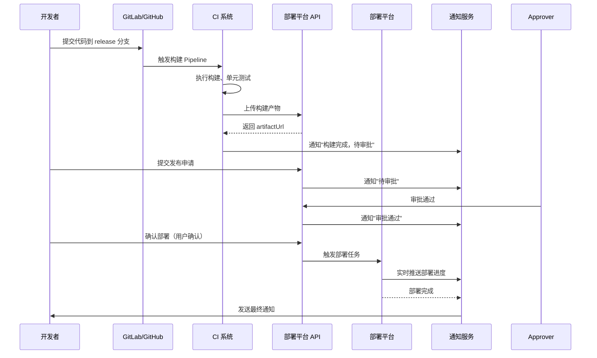
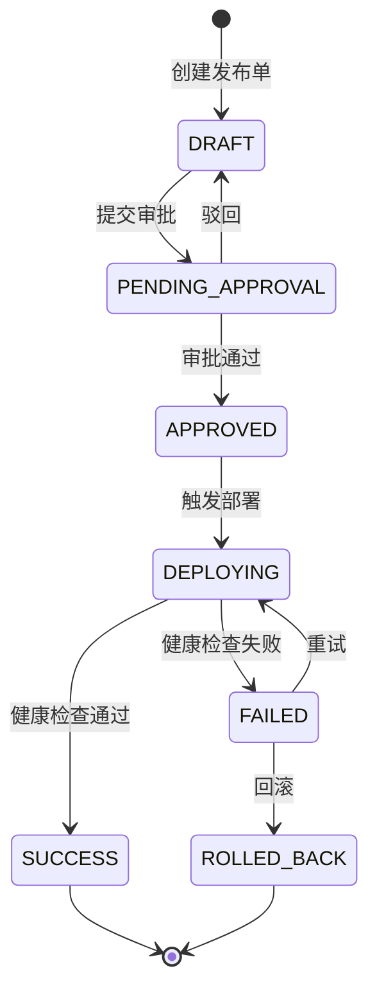

# 自动化部署流程规范

本文档旨在统一项目的自动化部署标准，确保后端（Java）与前端（Vue）项目发布的可靠性、一致性与可追溯性。所有生产环境的变更发布均需遵循此规范。

## 目录
- [一、 后端部署规范 (Backend)](#一-后端部署规范-backend)
- [二、 前端部署规范 (Frontend)](#二-前端部署规范-frontend)
- [三、 回滚机制 (Rollback)](#三-回滚机制-rollback)
- [四、 敏感信息管理](#四-敏感信息管理)
- [五、 发布审批流程 (Release Approval)](#五-发布审批流程-release-approval)
  - [1. 发布状态流转](#1-发布状态流转)
  - [2. 审批流程 API](#2-审批流程-api)
  - [3. 发布单数据表设计](#3-发布单数据表设计)
  - [4. 审批权限控制](#4-审批权限控制)
- [六、 部署触发机制 (Deployment Trigger)](#六-部署触发机制-deployment-trigger)
  - [1. 触发方式](#1-触发方式)
  - [2. 部署触发 API](#2-部署触发-api)
  - [3. Webhook 触发集成](#3-webhook-触发集成)
  - [4. 触发条件检查](#4-触发条件检查)
- [七、 部署状态追踪与通知 (Deployment Status & Notification)](#七-部署状态追踪与通知-deployment-status--notification)
  - [1. 部署状态实时推送](#1-部署状态实时推送)
  - [2. 部署通知渠道](#2-部署通知渠道)
  - [3. 通知模板](#3-通知模板)
  - [4. 部署状态查询 API](#4-部署状态查询-api)
- [八、 发布前检查清单 (Pre-Deployment Checklist)](#八-发布前检查清单-pre-deployment-checklist)
  - [1. 自动化检查项](#1-自动化检查项)
  - [2. 检查清单 API](#2-检查清单-api)
  - [3. 强制部署标记](#3-强制部署标记)
- [九、 审批日志与审计 (Audit Log)](#九-审批日志与审计-audit-log)
  - [1. 审计日志表设计](#1-审计日志表设计)
  - [2. 审计日志 API](#2-审计日志-api)
  - [3. 审计日志自动记录](#3-审计日志自动记录)
- [十、 与 CI/CD 系统集成 (CI/CD Integration)](#十-与-cicd-系统集成-cicd-integration)
  - [1. CI/CD Pipeline 触发流程](#1-cicd-pipeline-触发流程)
  - [2. CI 构建产物上传 API](#2-ci-构建产物上传-api)
  - [3. 部署执行器](#3-部署执行器)
  - [4. 部署任务调度](#4-部署任务调度)
- [十一、 回滚机制增强 (Enhanced Rollback)](#十一-回滚机制增强-enhanced-rollback)
  - [1. 回滚审批流程](#1-回滚审批流程)
  - [2. 自动回滚策略](#2-自动回滚策略)
- [十二、 规范总结](#十二-规范总结)

### 1. 环境与依赖
*   **运行环境**: CentOS 7+ / JDK 1.8+
*   **构建工具**: Maven 3.6+
*   **构建产物**: 可执行 JAR 包 (`*.jar`)

### 2. 构建流程 (Build)
1.  **代码检出**: 从 Git 仓库拉取指定分支（通常为 `master` 或 `release`）。
2.  **编译打包**:
    *   命令: `mvn clean package -DskipTests`
    *   **规范**: 禁止在生产构建中执行单元测试（应在 CI 阶段完成），以缩短发布窗口。
3.  **产物验证**:
    *   检查 `target/` 目录下是否生成 `jar` 文件。
    *   验证 JAR 包大小是否在合理范围内（避免依赖异常）。

### 3. 发布流程 (Deploy)
1.  **备份旧版本**:
    *   发布前**必须**备份当前运行的 JAR 包。
    *   命名规范: `{app-name}-{yyyyMMddHHmmss}.jar.bak`
2.  **优雅停机**:
    *   优先尝试 `kill -15` (SIGTERM)，等待应用释放资源。
    *   超时（如 30s）后强制 `kill -9`。
3.  **启动服务**:
    *   命令规范: 使用 `nohup` 后台启动，并指定 JVM 参数和配置文件。
    *   **关键参数**:
        *   `--spring.profiles.active=prod` (强制指定生产配置)
        *   `-Xms512m -Xmx1024m` (显式设置堆内存，防止 OOM)
        *   `--DB_PASSWORD=***` (敏感信息通过命令行参数或环境变量注入，禁止写死在配置文件)
4.  **健康检查 (Health Check)**:
    *   **日志检查**: 启动后 tail 日志，确认无 `ERROR` 且出现 `Started Application` 字样。
    *   **端口检查**: 确认 8080 端口处于 `LISTEN` 状态。
    *   **接口检查**: 调用 `/actuator/health` 或业务探针接口返回 200。

### 4. 自动化脚本支持 (Executable Specifications)

为确保 AI 和开发者能无歧义执行，提供标准的 Shell 脚本逻辑描述。

#### 4.1 后端部署脚本 (`scripts/deploy-backend.sh`)
*   **输入参数**:
    *   `ENV`: 环境名称 (prod/test)，必填。
*   **执行逻辑 (Pseudocode)**:
    ```bash
    #!/bin/bash
    
    # 1. 变量定义 (Configuration)
    APP_NAME="my-app"
    JAR_PATH="target/${APP_NAME}.jar"
    DEPLOY_DIR="/opt/apps/${APP_NAME}"
    BACKUP_DIR="${DEPLOY_DIR}/backup"
    PID_FILE="${DEPLOY_DIR}/app.pid"
    LOG_FILE="${DEPLOY_DIR}/logs/app.log"
    
    # 2. 检查环境 (Validation)
    if [ ! -f "$JAR_PATH" ]; then
        echo "Error: Build artifact not found at $JAR_PATH"
        exit 1
    fi
    
    # 3. 备份 (Backup)
    mkdir -p "$BACKUP_DIR"
    cp "${DEPLOY_DIR}/${APP_NAME}.jar" "${BACKUP_DIR}/${APP_NAME}-$(date +%Y%m%d%H%M%S).jar"
    
    # 4. 停机 (Stop)
    if [ -f "$PID_FILE" ]; then
        PID=$(cat "$PID_FILE")
        kill -15 "$PID"
        # 等待 30s，每秒检查一次
        for i in {1..30}; do
            if ! ps -p "$PID" > /dev/null; then break; fi
            sleep 1
        done
        # 强制杀进程
        if ps -p "$PID" > /dev/null; then kill -9 "$PID"; fi
    fi
    
    # 5. 启动 (Start)
    cp "$JAR_PATH" "${DEPLOY_DIR}/${APP_NAME}.jar"
    nohup java -jar \
        -Dspring.profiles.active="$1" \
        -Xms512m -Xmx1024m \
        "${DEPLOY_DIR}/${APP_NAME}.jar" > "$LOG_FILE" 2>&1 &
    
    echo $! > "$PID_FILE"
    
    # 6. 健康检查 (Health Check)
    # 轮询 http://localhost:8080/actuator/health 直到返回 200 或超时
    ```

#### 4.2 前端部署脚本 (`scripts/deploy-frontend.sh`)
*   **核心特性**: 原子发布 (Atomic Deployment)
*   **执行逻辑 (Pseudocode)**:
    ```bash
    #!/bin/bash
    
    # 1. 变量定义
    DIST_SRC="dist"
    WEB_ROOT="/usr/share/nginx/html"
    RELEASE_DIR="${WEB_ROOT}/releases/$(date +%Y%m%d%H%M%S)"
    CURRENT_LINK="${WEB_ROOT}/current"
    
    # 2. 部署新版本 (Deploy)
    mkdir -p "$RELEASE_DIR"
    cp -r "${DIST_SRC}/"* "$RELEASE_DIR"
    
    # 3. 原子切换 (Switch)
    # ln -sfn: 强制更新符号链接
    ln -sfn "$RELEASE_DIR" "$CURRENT_LINK"
    
    # 4. 清理旧版本 (Cleanup)
    # 保留最近 5 个版本
    ls -dt "${WEB_ROOT}/releases/"* | tail -n +6 | xargs rm -rf
    
    # 5. 重载 Nginx (Reload)
    nginx -s reload
    ```

---

## 二、 前端部署规范 (Frontend)

### 1. 环境与依赖
*   **运行环境**: Nginx 1.16+
*   **构建工具**: Node.js 16+ / npm
*   **构建产物**: 静态资源目录 (`dist/`)

### 2. 构建流程 (Build)
1.  **依赖安装**:
    *   命令: `npm ci` (推荐) 或 `npm install`。
    *   **规范**: 使用 `npm ci` 锁定依赖版本（基于 `package-lock.json`），确保构建一致性。
2.  **代码构建**:
    *   命令: `npm run build`
    *   **环境变量**: 确保加载 `.env.production`，其中 `VITE_API_BASE_URL` 必须指向生产环境网关地址。
3.  **产物验证**:
    *   检查 `dist/index.html` 是否存在。
    *   检查 `dist/assets/` 下是否有指纹化的 JS/CSS 文件。

### 3. 发布流程 (Deploy)
1.  **静态资源同步**:
    *   **原子性发布**: 推荐先将新版上传至临时目录，再通过软链接切换或瞬间覆盖，避免发布期间出现 404。
    *   **目标路径**: `/usr/share/nginx/html` (示例)。
2.  **Nginx 配置**:
    *   **Gzip**: 必须开启 `gzip_static on;`，优先使用构建产出的 `.gz` 文件。
    *   **SPA 路由**: 必须配置 `try_files $uri $uri/ /index.html;`，防止刷新页面 404。
    *   **缓存策略**:
        *   `index.html`: `no-cache` (确保用户获取最新版本)。
        *   `assets/*.js|css`: `long-term cache` (利用文件名指纹缓存)。
3.  **服务重载**:
    *   命令: `nginx -t` (语法检查) -> `systemctl reload nginx` (平滑重载)。

### 4. 自动化脚本支持
提供实现 **原子发布 (Atomic Deployment)** 的脚本：
*   **脚本路径**: `scripts/deploy-frontend.sh`
*   **使用方法**:
    ```bash
    chmod +x scripts/deploy-frontend.sh
    ./scripts/deploy-frontend.sh prod
    ```
*   **功能**: 自动构建、生成版本号目录、切换软链接（0秒停机）、自动清理旧版本。

---

## 三、 回滚机制 (Rollback)

为确保 AI 和运维人员在紧急情况下能快速恢复服务，定义以下标准回滚操作。

### 1. 后端回滚脚本逻辑 (Pseudocode)
*   **脚本路径**: `scripts/rollback-backend.sh`
*   **逻辑**:
    ```bash
    # 1. 查找最近的备份文件
    LATEST_BACKUP=$(ls -t "${BACKUP_DIR}/"*.jar | head -n 1)
    
    if [ -z "$LATEST_BACKUP" ]; then
        echo "Error: No backup found!"
        exit 1
    fi
    
    # 2. 停止当前服务 (同部署脚本)
    ...
    
    # 3. 恢复备份
    cp "$LATEST_BACKUP" "${DEPLOY_DIR}/${APP_NAME}.jar"
    
    # 4. 启动服务 (同部署脚本)
    ...
    ```

### 2. 前端回滚脚本逻辑 (Pseudocode)
*   **脚本路径**: `scripts/rollback-frontend.sh`
*   **逻辑**:
    ```bash
    # 1. 查找上一个版本目录
    PREV_RELEASE=$(ls -dt "${WEB_ROOT}/releases/"* | head -n 2 | tail -n 1)
    
    # 2. 切换软链接
    ln -sfn "$PREV_RELEASE" "$CURRENT_LINK"
    
    # 3. 重载 Nginx
    nginx -s reload
    ```

---

## 四、 敏感信息管理

*   **原则**: 代码仓库中**严禁**包含生产环境的密码、密钥。
*   **实现**:
    *   **后端**: 数据库密码、JWT 密钥通过 Jenkins/GitLab CI 的 `Secrets` 注入，或在服务器启动脚本中通过环境变量设置。
    *   **前端**: 仅包含非敏感的公开配置（如 API Base URL）。

## 五、 发布审批流程 (Release Approval)

为支持"用户确认完成后自动化部署"，需建立完整的发布审批机制。

### 1. 发布状态流转
| 状态 | 说明 | 触发条件 | 可执行操作 |
|------|------|----------|------------|
| `DRAFT` | 草稿 | 版本创建 | 编辑、提交审批 |
| `PENDING_APPROVAL` | 待审批 | 提交审批 | 审批通过、驳回 |
| `APPROVED` | 已审批 | 审批通过 | 触发部署 |
| `DEPLOYING` | 部署中 | 触发部署 | 查看进度 |
| `SUCCESS` | 部署成功 | 健康检查通过 | 完成 |
| `FAILED` | 部署失败 | 健康检查失败 | 重试、回滚 |
| `ROLLED_BACK` | 已回滚 | 执行回滚 | - |

### 2. 审批流程 API
```java
// 发布单 API (供 AI 生成代码使用)
@RestController
@RequestMapping("/api/v1/releases")
public class ReleaseController {
    
    /**
     * 创建发布单
     * @param req 发布请求
     * @return 发布单 ID
     */
    @PostMapping
    public Result<String> create(@RequestBody @Valid ReleaseCreateReq req);
    
    /**
     * 提交审批
     * @param releaseId 发布单 ID
     */
    @PostMapping("/{releaseId}/submit");
    
    /**
     * 审批通过/驳回（需权限控制）
     * @param releaseId 发布单 ID
     * @param req 审批请求
     */
    @PostMapping("/{releaseId}/approve");
    
    /**
     * 用户确认后触发部署
     * @param releaseId 发布单 ID
     */
    @PostMapping("/{releaseId}/deploy");
    
    /**
     * 查询发布状态
     * @param releaseId 发布单 ID
     */
    @GetMapping("/{releaseId}");
}

// 发布单请求对象
@Data
public class ReleaseCreateReq {
    @NotBlank
    private String version;        // 版本号 v1.0.0
    
    @NotBlank
    private String branch;         // 分支名
    
    private String commitHash;     // 提交 SHA
    
    private String artifactUrl;    // 构建产物地址
    
    private String releaseNotes;   // 发布说明
    
    private String approver;       // 审批人（可选）
}

// 审批请求对象
@Data
public class ApprovalReq {
    private Boolean approved;      // true: 通过, false: 驳回
    
    private String comment;        // 审批意见
}
```

### 3. 发布单数据表设计
```sql
CREATE TABLE t_release (
    id              BIGINT PRIMARY KEY AUTO_INCREMENT,
    release_no      VARCHAR(32) NOT NULL UNIQUE COMMENT '发布单号 REL_20240101_001',
    version         VARCHAR(50) NOT NULL COMMENT '版本号 v1.0.0',
    branch          VARCHAR(100) NOT NULL COMMENT '分支名',
    commit_hash     VARCHAR(40) COMMENT 'Git 提交 SHA',
    artifact_url    VARCHAR(500) COMMENT '构建产物地址',
    release_notes   TEXT COMMENT '发布说明',
    status          TINYINT DEFAULT 1 COMMENT '状态: 1-DRAFT, 2-PENDING_APPROVAL, 3-APPROVED, 4-DEPLOYING, 5-SUCCESS, 6-FAILED, 7-ROLLED_BACK',
    env             VARCHAR(20) NOT NULL COMMENT '环境: prod, test, dev',
    approver        VARCHAR(50) COMMENT '审批人',
    approved_at     DATETIME COMMENT '审批时间',
    deployed_at     DATETIME COMMENT '部署时间',
    deployer        VARCHAR(50) COMMENT '部署人',
    error_message   TEXT COMMENT '错误信息',
    created_by      VARCHAR(50) NOT NULL,
    created_at      DATETIME DEFAULT CURRENT_TIMESTAMP,
    updated_at      DATETIME DEFAULT CURRENT_TIMESTAMP ON UPDATE CURRENT_TIMESTAMP,
    INDEX idx_status (status),
    INDEX idx_env (env),
    INDEX idx_version (version)
) ENGINE=InnoDB DEFAULT CHARSET=utf8mb4;
```

### 4. 审批权限控制
*   **普通发布**：需部门负责人审批
*   **紧急发布**：需技术负责人审批 + 事后补充说明
*   **热修复**：可直接发布 + 事后审批
*   **审批人检查**：
    ```java
    @PreAuthorize("hasAnyRole('LEADER', 'TECH_LEADER')")
    @PostMapping("/{releaseId}/approve")
    public Result<Void> approve(@PathVariable String releaseId, @RequestBody ApprovalReq req);
    ```

## 六、 部署触发机制 (Deployment Trigger)

### 1. 触发方式
| 触发方式 | 适用场景 | 说明 |
|----------|----------|------|
| **API 触发** | 用户确认后手动触发 | 调用部署 API |
| **Webhook 触发** | CI/CD 系统集成 | GitLab/Jenkins webhook |
| **定时触发** | 预发布验证 | 定时任务自动部署 |
| **审批后自动触发** | 用户审批完成 | 审批通过后自动触发 |

### 2. 部署触发 API
```java
@RestController
@RequestMapping("/api/v1/deploy")
public class DeploymentController {
    
    /**
     * 触发部署（用户确认后调用）
     * @param req 部署请求
     * @return 部署任务 ID
     */
    @PostMapping("/trigger")
    public Result<String> trigger(@RequestBody @Valid DeployTriggerReq req);
    
    /**
     * 查询部署进度
     * @param taskId 任务 ID
     */
    @GetMapping("/progress/{taskId}");
    
    /**
     * 取消部署
     * @param taskId 任务 ID
     */
    @PostMapping("/cancel/{taskId}");
}

// 部署触发请求
@Data
public class DeployTriggerReq {
    @NotBlank
    private String releaseNo;      // 发布单号
    
    @NotBlank
    private String env;            // 环境 prod/test
    
    private Boolean forceDeploy;   // 是否强制部署（跳过检查）
}

// 部署进度响应
@Data
public class DeployProgressResp {
    private String taskId;
    private String releaseNo;
    private String status;         // DEPLOYING/SUCCESS/FAILED
    private Integer progress;      // 0-100
    private String currentStep;    // 当前步骤描述
    private List<DeployStepResp> steps;
}

@Data
public class DeployStepResp {
    private String stepName;       // 步骤名称
    private String status;         // PENDING/RUNNING/SUCCESS/FAILED
    private String message;        // 步骤消息
    private Long duration;         // 耗时 ms
}
```

### 3. Webhook 触发集成
```java
@RestController
@RequestMapping("/api/v1/webhooks")
public class WebhookController {
    
    /**
     * CI/CD 系统 Webhook（GitLab/Jenkins）
     * @param payload Webhook 载荷
     * @param signature 签名校验
     */
    @PostMapping("/cicd")
    public Result<String> handleCicdWebhook(
        @RequestBody String payload,
        @RequestHeader("X-Gitlab-Token") String signature);
}

// Webhook 载荷格式
{
    "event": "deploy",
    "version": "v1.0.0",
    "branch": "release/v1.0.0",
    "artifactUrl": "http://nexus.example.com/my-app-1.0.0.jar",
    "env": "prod",
    "autoDeploy": false,           // 是否审批后自动部署
    "timestamp": "2024-01-15T10:30:00Z"
}
```

### 4. 触发条件检查
```java
// 部署触发前置检查
public void validateDeployTrigger(DeployTriggerReq req) {
    // 1. 检查发布单状态
    Release release = releaseService.getByNo(req.getReleaseNo());
    if (!"APPROVED".equals(release.getStatus())) {
        throw new BusinessException("30001", "发布单未审批通过，无法部署");
    }
    
    // 2. 检查环境是否被锁定
    if (deployLockService.isLocked(req.getEnv())) {
        throw new BusinessException("30002", "该环境正在部署中，请稍后重试");
    }
    
    // 3. 检查是否有未完成的发布
    if (releaseService.hasPendingRelease(req.getEnv())) {
        throw new BusinessException("30003", "该环境有待处理的发布任务");
    }
}
```

## 七、 部署状态追踪与通知 (Deployment Status & Notification)

### 1. 部署状态实时推送
```java
// 使用 SSE (Server-Sent Events) 推送部署进度
@GetMapping("/progress/stream/{taskId}")
public SseEmitter streamProgress(@PathVariable String taskId) {
    SseEmitter emitter = new SseEmitter(300000L); // 5分钟超时
    
    DeployProgressListener.addEmitter(taskId, emitter);
    
    return emitter;
}

// 状态更新推送示例
public void publishProgress(String taskId, DeployProgressResp progress) {
    List<SseEmitter> emitters = DeployProgressListener.getEmitters(taskId);
    emitters.forEach(emitter -> {
        try {
            emitter.send(SseEmitter.event()
                .name("progress")
                .data(JSON.toJSONString(progress)));
        } catch (IOException e) {
            emitter.completeWithError(e);
        }
    });
}
```

### 2. 部署通知渠道
| 通知方式 | 触发场景 | 接收人 |
|----------|----------|--------|
| **站内通知** | 所有状态变更 | 发布申请人、审批人 |
| **邮件通知** | 审批通过/部署完成/失败 | 发布申请人、审批人、运维 |
| **钉钉/企业微信** | 部署关键节点 | 技术群组 |
| **短信** | 部署严重失败（生产环境） | 技术负责人 |

### 3. 通知模板
```java
// 通知载荷定义
@Data
public class DeployNotification {
    private String type;           // APPROVAL/DEPLOY_SUCCESS/DEPLOY_FAILED
    private String title;
    private String content;
    private String releaseNo;
    private String version;
    private String env;
    private String link;           // 跳转链接
    private LocalDateTime timestamp;
}

// 部署成功通知
{
    "type": "DEPLOY_SUCCESS",
    "title": "部署成功",
    "content": "发布单 REL_20240101_001 版本 v1.0.0 已成功部署至生产环境",
    "releaseNo": "REL_20240101_001",
    "version": "v1.0.0",
    "env": "prod",
    "link": "/releases/REL_20240101_001",
    "timestamp": "2024-01-15T10:35:00Z"
}
```

### 4. 部署状态查询 API
```java
@RestController
@RequestMapping("/api/v1/deployments")
public class DeploymentHistoryController {
    
    /**
     * 查询部署历史
     */
    @GetMapping
    public Result<PageResult<DeploymentResp>> list(@ModelAttribute DeploymentQuery query);
    
    /**
     * 查询部署详情
     */
    @GetMapping("/{taskId}");
    
    /**
     * 查询环境当前部署版本
     */
    @GetMapping("/env/{env}/current-version");
}

// 部署历史查询响应
@Data
public class DeploymentResp {
    private String taskId;
    private String releaseNo;
    private String version;
    private String env;
    private String status;
    private String deployer;
    private LocalDateTime startedAt;
    private LocalDateTime finishedAt;
    private Long duration;         // 部署耗时 秒
    private String errorMessage;
}
```

## 八、 发布前检查清单 (Pre-Deployment Checklist)

### 1. 自动化检查项
```java
@Data
public class PreDeployCheckResult {
    private Boolean allPassed;
    private List<CheckItem> items;
    
    @Data
    public static class CheckItem {
        private String name;
        private Boolean passed;
        private String message;
    }
}

// 检查服务
@Service
public class PreDeployCheckService {
    
    public PreDeployCheckResult check(String releaseNo, String env) {
        PreDeployCheckResult result = new PreDeployCheckResult();
        List<PreDeployCheckResult.CheckItem> items = new ArrayList<>();
        
        // 1. 检查发布单状态
        items.add(checkReleaseStatus(releaseNo));
        
        // 2. 检查环境健康
        items.add(checkEnvHealth(env));
        
        // 3. 检查依赖服务
        items.add(checkDependencies(env));
        
        // 4. 检查数据库迁移
        items.add(checkDatabaseMigration(releaseNo));
        
        // 5. 检查回滚方案
        items.add(checkRollbackPlan(releaseNo));
        
        // 6. 检查通知配置
        items.add(checkNotificationConfig(env));
        
        result.setItems(items);
        result.setAllPassed(items.stream().allMatch(PreDeployCheckResult.CheckItem::getPassed));
        
        return result;
    }
    
    private PreDeployCheckResult.CheckItem checkReleaseStatus(String releaseNo) {
        Release release = releaseService.getByNo(releaseNo);
        boolean passed = "APPROVED".equals(release.getStatus());
        return new PreDeployCheckResult.CheckItem(
            "发布单状态检查",
            passed,
            passed ? "发布单已审批通过" : "发布单未审批或已被驳回"
        );
    }
    
    private PreDeployCheckResult.CheckItem checkEnvHealth(String env) {
        // 检查目标环境服务是否正常
        boolean passed = healthCheckService.checkEnv(env);
        return new PreDeployCheckResult.CheckItem(
            "环境健康检查",
            passed,
            passed ? "环境健康状态正常" : "环境存在异常服务"
        );
    }
    
    private PreDeployCheckResult.CheckItem checkDependencies(String env) {
        // 检查上下游依赖是否正常
        boolean passed = dependencyCheckService.checkDependencies(env);
        return new PreDeployCheckResult.CheckItem(
            "依赖服务检查",
            passed,
            passed ? "所有依赖服务正常" : "存在不可用的依赖服务"
        );
    }
}
```

### 2. 检查清单 API
```java
@RestController
@RequestMapping("/api/v1/releases")
public class ReleaseCheckController {
    
    /**
     * 执行发布前检查
     * @param releaseNo 发布单号
     * @param env 环境
     */
    @GetMapping("/{releaseNo}/pre-check")
    public Result<PreDeployCheckResult> preCheck(
        @PathVariable String releaseNo,
        @RequestParam String env);
    
    /**
     * 获取检查报告
     * @param releaseNo 发布单号
     */
    @GetMapping("/{releaseNo}/check-report");
```

### 3. 强制部署标记
*   **说明**：某些检查项失败时，允许有权限用户选择"强制部署"
*   **权限**：仅 `TECH_LEADER` 或 `ADMIN` 角色可强制部署
*   **审计**：强制部署需记录原因和操作人
```java
@Data
public class ForceDeployReq {
    private String reason;         // 强制部署原因
    private String confirmedBy;    // 确认人
}

@PreAuthorize("hasAnyRole('TECH_LEADER', 'ADMIN')")
@PostMapping("/{releaseId}/force-deploy")
public Result<String> forceDeploy(
    @PathVariable String releaseId,
    @RequestBody @Valid ForceDeployReq req);
```

## 九、 审批日志与审计 (Audit Log)

### 1. 审计日志表设计
```sql
CREATE TABLE t_release_audit_log (
    id              BIGINT PRIMARY KEY AUTO_INCREMENT,
    release_no      VARCHAR(32) NOT NULL COMMENT '发布单号',
    action          VARCHAR(50) NOT NULL COMMENT '操作类型: CREATE/SUBMIT/APPROVE/REJECT/DEPLOY/CANCEL/ROLLBACK',
    operator        VARCHAR(50) NOT NULL COMMENT '操作人',
    operator_role   VARCHAR(50) COMMENT '操作人角色',
    before_status   VARCHAR(20) COMMENT '操作前状态',
    after_status    VARCHAR(20) COMMENT '操作后状态',
    request_params  TEXT COMMENT '请求参数',
    response        TEXT COMMENT '响应结果',
    ip_address      VARCHAR(45) COMMENT 'IP地址',
    user_agent      VARCHAR(500) COMMENT '浏览器/客户端信息',
    remark          VARCHAR(500) COMMENT '备注/意见',
    created_at      DATETIME DEFAULT CURRENT_TIMESTAMP,
    INDEX idx_release_no (release_no),
    INDEX idx_operator (operator),
    INDEX idx_action (action),
    INDEX idx_created_at (created_at)
) ENGINE=InnoDB DEFAULT CHARSET=utf8mb4;
```

### 2. 审计日志 API
```java
@RestController
@RequestMapping("/api/v1/audit-logs")
public class AuditLogController {
    
    /**
     * 查询发布单审计日志
     */
    @GetMapping("/releases/{releaseNo}");
    
    /**
     * 查询操作日志（按操作人）
     */
    @GetMapping("/operators/{operator}");
    
    /**
     * 导出审计报告
     */
    @GetMapping("/export");
```

### 3. 审计日志自动记录
```java
@Aspect
@Component
public class AuditLogAspect {
    
    @Around("@annotation(AuditLog)")
    public Object audit(ProceedingJoinPoint point) throws Throwable {
        AuditLog annotation = point.getTarget().getClass()
            .getMethod(point.getSignature().getName())
            .getAnnotation(AuditLog.class);
        
        // 记录操作前状态
        String beforeStatus = getBeforeStatus(annotation.entity(), point.getArgs());
        
        // 执行操作
        Object result = point.proceed();
        
        // 记录操作后状态
        String afterStatus = getAfterStatus(annotation.entity(), point.getArgs());
        
        // 写入审计日志
        auditLogService.save(AuditLog.builder()
            .action(annotation.action())
            .operator(SecurityUtils.getCurrentUser())
            .operatorRole(SecurityUtils.getCurrentUserRole())
            .beforeStatus(beforeStatus)
            .afterStatus(afterStatus)
            .requestParams(JSON.toJSONString(point.getArgs()))
            .build());
        
        return result;
    }
}

// 使用示例
@AuditLog(action = "APPROVE", entity = Release.class)
@PostMapping("/{releaseId}/approve")
public Result<Void> approve(@PathVariable String releaseId, @RequestBody ApprovalReq req);
```

## 十、 与 CI/CD 系统集成 (CI/CD Integration)

### 1. CI/CD Pipeline 触发流程


### 2. CI 构建产物上传 API
```java
@RestController
@RequestMapping("/api/v1/artifacts")
public class ArtifactController {
    
    /**
     * 上传构建产物
     * @param file 构建产物文件
     * @param metadata 元数据
     */
    @PostMapping("/upload")
    public Result<ArtifactResp> upload(
        @RequestParam("file") MultipartFile file,
        @RequestParam("version") String version,
        @RequestParam("branch") String branch,
        @RequestParam("env") String env);
    
    /**
     * 下载构建产物
     */
    @GetMapping("/{artifactId}/download");
}

@Data
public class ArtifactResp {
    private String artifactId;
    private String artifactUrl;
    private Long fileSize;
    private String md5;
}
```

### 3. 部署执行器 (AI 生成代码使用)
```java
@Component
public class DeploymentExecutor {
    
    private final DeployScriptRunner scriptRunner;
    private final NotificationService notificationService;
    private final AuditLogService auditLogService;
    
    /**
     * 执行后端部署
     */
    public DeployResult executeBackend(DeployContext context) {
        try {
            // 1. 下载产物
            String jarPath = downloadArtifact(context.getArtifactUrl());
            
            // 2. 执行部署脚本
            ScriptExecutionResult result = scriptRunner.execute(
                "scripts/deploy-backend.sh",
                context.getEnv(),
                jarPath
            );
            
            // 3. 健康检查
            HealthCheckResult health = healthCheck(context.getEnv());
            
            if (health.isHealthy()) {
                return DeployResult.success(result.getOutput());
            } else {
                return DeployResult.failed("健康检查失败: " + health.getMessage());
            }
        } catch (Exception e) {
            return DeployResult.failed(e.getMessage());
        }
    }
    
    /**
     * 执行前端部署
     */
    public DeployResult executeFrontend(DeployContext context) {
        // 类似逻辑
    }
}
```

### 4. 部署任务调度
```java
@Service
public class DeploymentTaskService {
    
    @Async
    public void executeAsync(DeployContext context) {
        DeploymentTask task = createTask(context);
        
        try {
            task.setStatus("DEPLOYING");
            task.setStartedAt(LocalDateTime.now());
            taskRepository.save(task);
            
            // 推送进度
            publishProgress(task.getTaskId(), "开始部署", 10);
            
            // 执行部署
            DeployResult result = deploymentExecutor.execute(context);
            
            task.setStatus(result.isSuccess() ? "SUCCESS" : "FAILED");
            task.setFinishedAt(LocalDateTime.now());
            task.setDuration(calculateDuration(task));
            task.setErrorMessage(result.getMessage());
            taskRepository.save(task);
            
            // 推送最终状态
            publishFinalStatus(task);
            
            // 发送通知
            notificationService.sendDeployResult(task);
            
        } catch (Exception e) {
            task.setStatus("FAILED");
            task.setErrorMessage(e.getMessage());
            taskRepository.save(task);
            
            // 发送失败通知
            notificationService.sendDeployFailed(task);
        }
    }
}
```

## 十一、 回滚机制增强 (Enhanced Rollback)

### 1. 回滚审批流程
```java
// 回滚也需审批，确保操作可追溯
@PostMapping("/{releaseNo}/rollback-request")
public Result<String> requestRollback(@PathVariable String releaseNo);

@PreAuthorize("hasAnyRole('LEADER', 'TECH_LEADER')")
@PostMapping("/{releaseNo}/rollback-approve")
public Result<Void> approveRollback(@PathVariable String releaseNo);

@PostMapping("/{releaseNo}/execute-rollback")
public Result<Void> executeRollback(@PathVariable String releaseNo);
```

### 2. 自动回滚策略
```java
@Service
public class AutoRollbackService {
    
    /**
     * 自动回滚检测（部署失败时）
     */
    public void detectAndAutoRollback(DeploymentTask task) {
        if (!task.getEnv().equals("prod")) {
            return; // 非生产环境不自动回滚
        }
        
        // 检查是否配置了自动回滚
        if (!featureToggleService.isEnabled("auto.rollback.on.failure")) {
            return;
        }
        
        // 通知管理员决策
        notificationService.sendRollbackDecisionRequired(task);
    }
}
```

## 十二、 规范总结

### 完整发布流程


### AI 生成代码检查清单
为确保 AI 生成的部署代码符合规范，需检查：
- [ ] 发布单状态机完整（7 种状态）
- [ ] 审批 API 包含权限控制
- [ ] 部署触发包含前置检查
- [ ] 部署进度支持实时推送
- [ ] 通知模板覆盖所有关键节点
- [ ] 审计日志记录所有操作
- [ ] 回滚流程包含审批机制
- [ ] 敏感信息不硬编码

### 关键配置项
| 配置项 | 说明 | 示例值 |
|--------|------|--------|
| `deploy.backup.dir` | 备份目录 | `/opt/apps/backup` |
| `deploy.script.timeout` | 脚本执行超时（秒） | 300 |
| `deploy.health.check.timeout` | 健康检查超时（秒） | 60 |
| `deploy.retry.max` | 最大重试次数 | 3 |
| `deploy.auto.rollback` | 是否开启自动回滚 | false（生产建议 false） |
| `notification.enabled` | 是否开启通知 | true |
| `audit.log.enabled` | 是否开启审计日志 | true |
